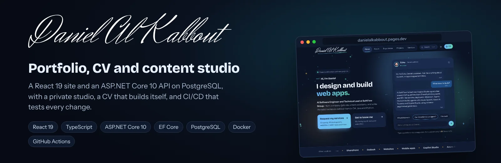
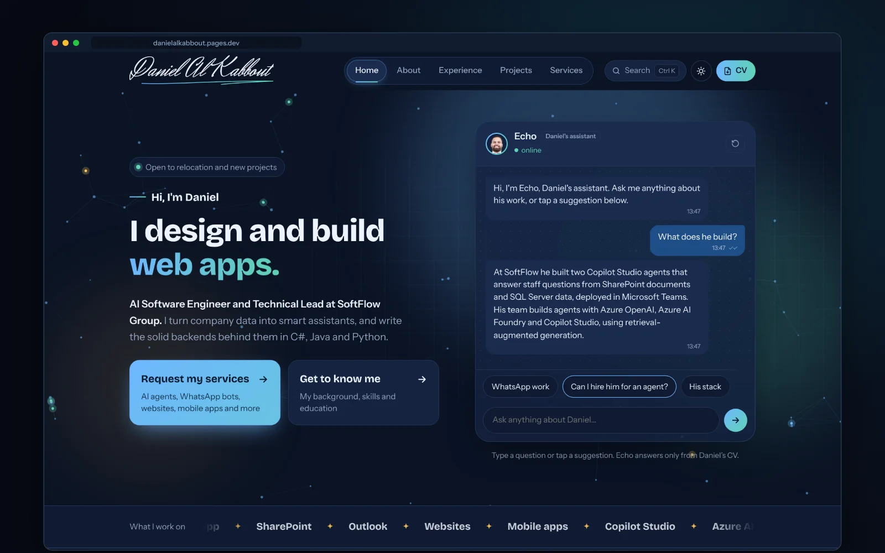
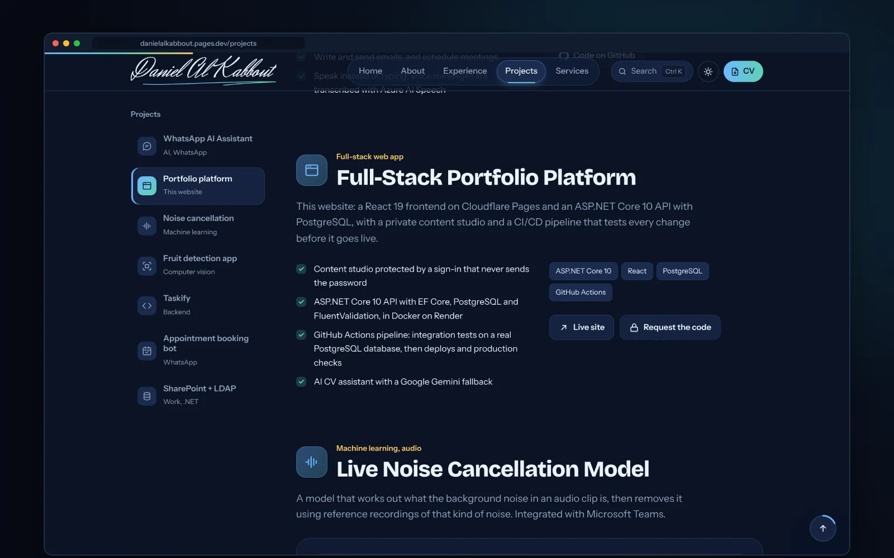
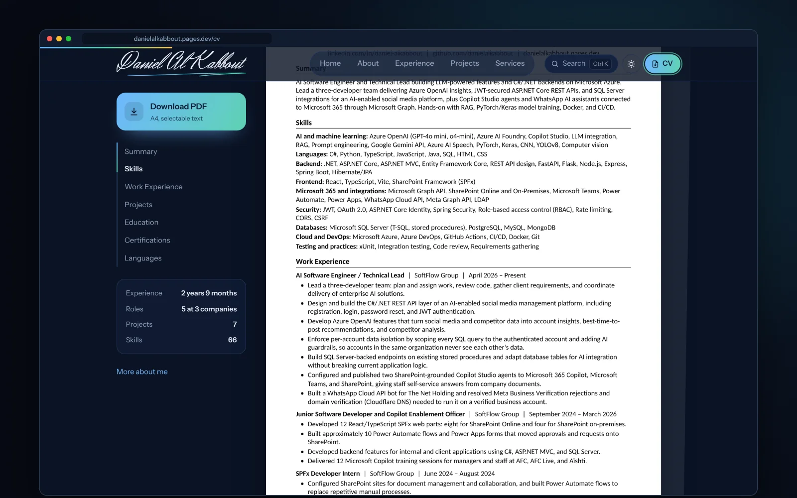
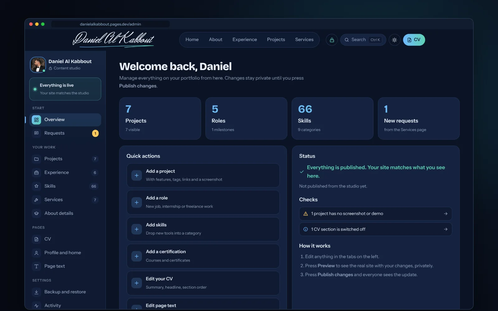
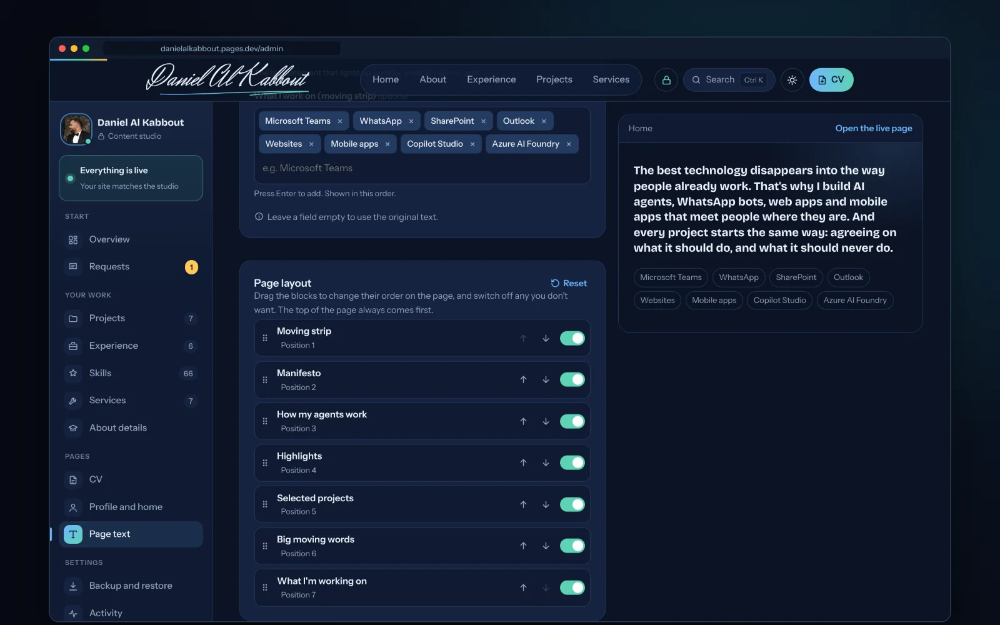
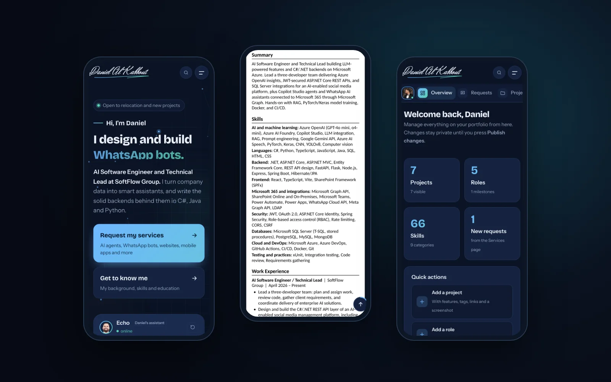
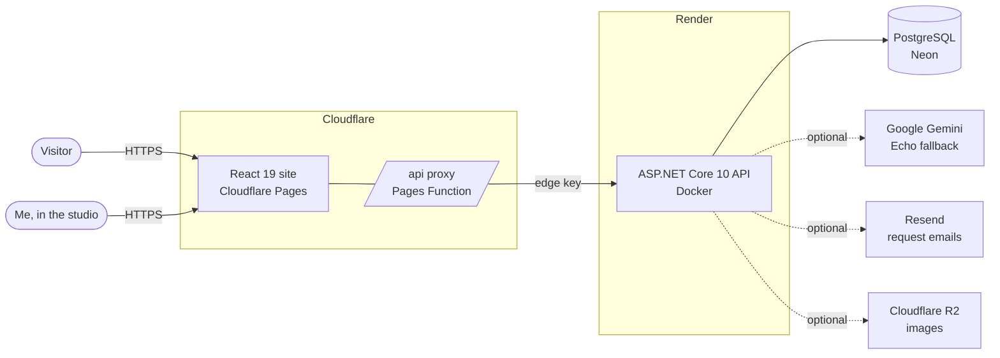
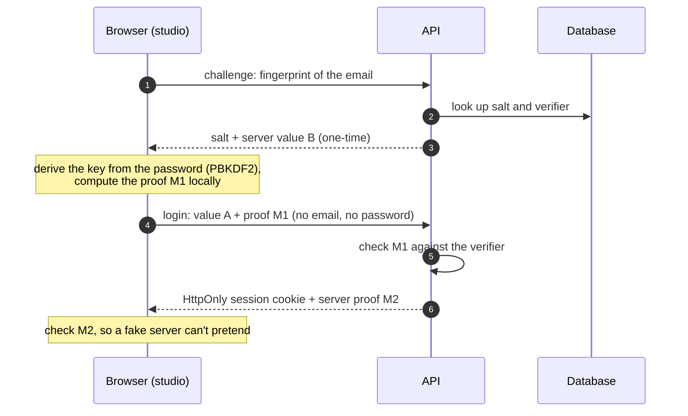
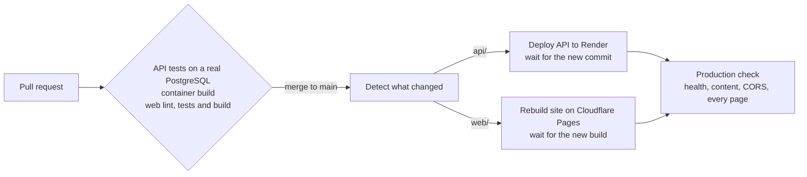

<p align="center">
  
</p>

<p align="center">
  <a href="https://danielalkabbout.pages.dev"><b>Live site</b></a> ·
  <a href="https://danielalkabbout.pages.dev/cv"><b>CV</b></a> ·
  <a href="https://danielalkabbout.pages.dev/projects"><b>Projects</b></a> ·
  <a href="SECURITY.md"><b>Security</b></a> ·
  <a href="docs/DEPLOY.md"><b>Hosting guide</b></a>
</p>

<p align="center">
  <a href="https://github.com/danielalkabbout/Daniel-Portfolio/actions/workflows/pipeline.yml"></a>
  
  
  
  
</p>

My portfolio, built as a small full-stack product rather than a static page: a React site, an ASP.NET Core API
with a PostgreSQL database, a private studio where I edit everything, and a pipeline that tests every change
before it goes live.

<p align="center">
  
</p>

## What's inside

| | |
| --- | --- |
| **Echo, a CV assistant** | Answers questions about my work from a rule engine built on my CV, and falls back to Google Gemini for anything the rules don't cover. |
| **Interactive projects** | Live demos (a WhatsApp chat, a noise-cancellation pipeline, an object detector, a terminal) and architecture views for each project. Private code can be requested with one click. |
| **A CV that builds itself** | The CV page and its A4 PDF are generated from the same content as the site, so a new project or role appears on the CV automatically. |
| **Content studio** | A private `/admin` where every project, role, skill, heading, card and home page block can be edited, reordered by drag and drop, previewed and published. |
| **Requests inbox** | The services form and code requests are saved to the database, listed in the studio and emailed to me. |
| **Secure by design** | SRP sign-in where the password never leaves the browser, HttpOnly session cookies, CSRF checks, rate limits, bot protection and a strict CSP. |
| **Fully responsive** | Designed for phones as carefully as for desktop, in dark and light themes. |

## Screenshots

<table>
  <tr>
    <td width="50%"><br><sub><b>Projects:</b> demos, stack and links, or a code request when the repository is private</sub></td>
    <td width="50%"><br><sub><b>CV:</b> generated from the site content, with a real A4 PDF download</sub></td>
  </tr>
  <tr>
    <td width="50%"><br><sub><b>Studio:</b> overview, publish status and quick actions</sub></td>
    <td width="50%"><br><sub><b>Page text and layout:</b> edit every section and drag the home page blocks into any order</sub></td>
  </tr>
</table>

<p align="center">
  
</p>

## Architecture



The browser only ever talks to its own origin. A Cloudflare Pages Function forwards `/api` calls to the API
with a shared edge key, so the API can refuse anything that didn't come through the site, and the session
cookie can stay `SameSite=Strict`. Each production build also bakes the latest content into the site, so it
renders instantly even while the free API host is asleep.

## How the studio sign-in works

The studio uses **SRP-6a** ([RFC 5054](https://datatracker.ietf.org/doc/html/rfc5054)): the browser proves it
knows the password without ever sending it, and the database stores only a salt and a verifier.



Five wrong attempts lock the account for a while, and changing the password ends every other session.

## How changes ship



Nothing deploys unless its tests pass, and only the part that changed is redeployed. Dependabot opens weekly
update pull requests, which go through the same checks.

## Tech stack

| Part | Stack | Hosting |
| --- | --- | --- |
| `web/` | React 19, TypeScript, Vite, React Router, TanStack Query, zod, jsPDF, Vitest | Cloudflare Pages |
| `api/` | ASP.NET Core 10, EF Core, FluentValidation, SRP-6a, JWT in HttpOnly cookies, xUnit | Render (Docker) |
| Database | PostgreSQL | Neon |
| Pipeline | GitHub Actions, Dependabot | GitHub |

## Repository layout

```
api/
  src/Portfolio.Api/             controllers, SRP sign-in, validation, Echo, email alerts
  src/Portfolio.Domain/          entities
  src/Portfolio.Infrastructure/  EF Core, migrations, content service, seed
  tests/Portfolio.Tests/         xUnit integration tests against PostgreSQL
web/
  src/pages/                     Home, About, Experience, Projects, Services, CV, Admin
  src/features/                  studio, CV builder and PDF, Echo, project demos
  functions/api/                 Cloudflare Pages Function that forwards /api
  public/_headers                security headers and caching
.github/workflows/               pipeline, PR checks, keep-warm
docs/                            hosting guide and README images
```

## Run it locally

You need the [.NET 10 SDK](https://dotnet.microsoft.com/download), [Node.js 22](https://nodejs.org) and a
PostgreSQL database (local or a free Neon branch).

```bash
# API: http://localhost:5080
cd api
dotnet user-secrets --project src/Portfolio.Api set "ConnectionStrings:Default" "Host=localhost;Database=portfolio;Username=postgres;Password=..."
dotnet run --project src/Portfolio.Api -- migrate        # create the tables and the starting content
dotnet run --project src/Portfolio.Api -- create-admin   # your studio account (asks for email and password)
dotnet run --project src/Portfolio.Api
dotnet test                                              # set TEST_DB to run the integration tests

# Website: http://localhost:5173
cd web
cp .env.example .env.local    # VITE_API_URL=http://localhost:5080
npm install
npm run dev
npm test
```

Without `VITE_API_URL` the site still runs on its bundled content; the studio needs the API.
Hosting it for free, step by step, is in [docs/DEPLOY.md](docs/DEPLOY.md), and the website's details are in
[web/README.md](web/README.md).

## Security

This repository is public and holds no secrets: keys, passwords and connection strings live only in the
hosting dashboards and GitHub Actions secrets. See [SECURITY.md](SECURITY.md) for how the site is protected
and how to report a problem.

---

<p align="center">
  Built by <a href="https://www.linkedin.com/in/daniel-alkabbout">Daniel Al Kabbout</a>, AI Software Engineer (C#/.NET), Lebanon
</p>
